# HW3

###此為本周作業

作業的commit比較少，是因為我有截圖但是卻忘記每一次都commit，之後要多習慣完成一個功能就要commit一次

說明：

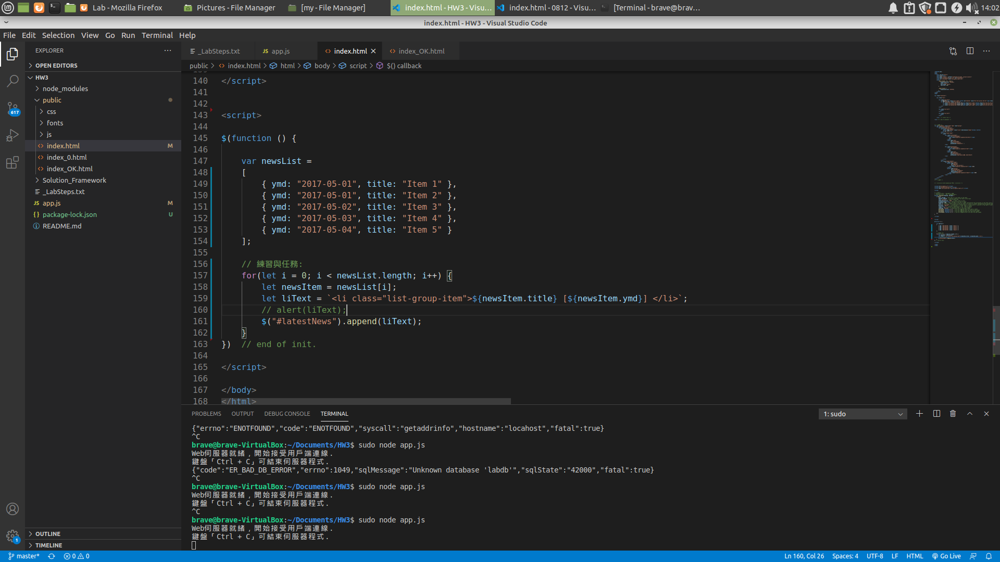
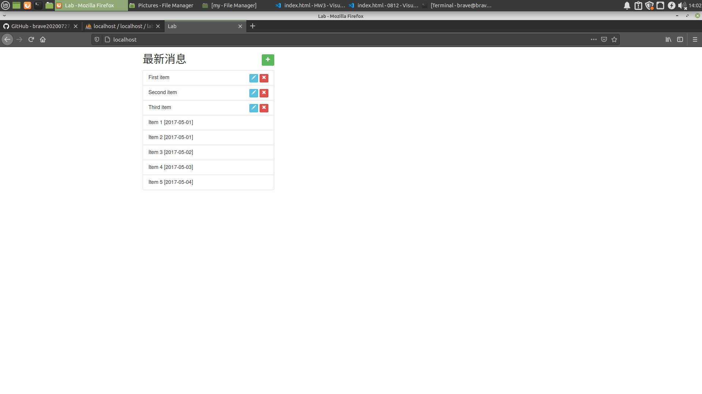
這兩張圖片為實作出將newsList中的元素放入到html的ul中。

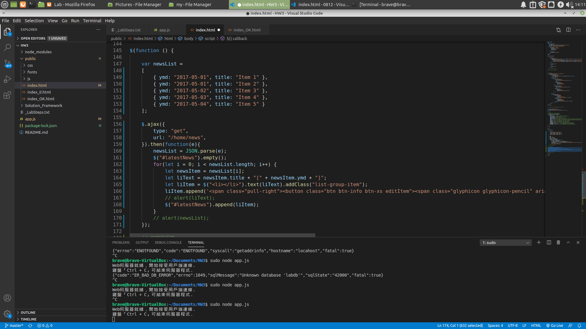
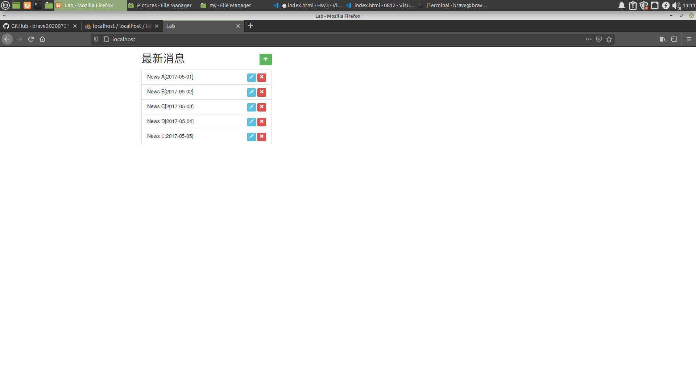
是將資料庫中的資料抓出來並且放到html的ul中。

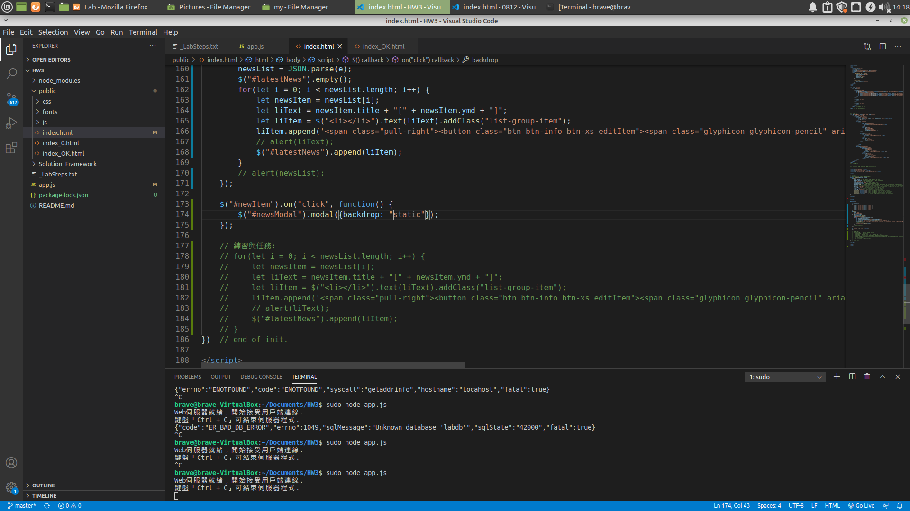
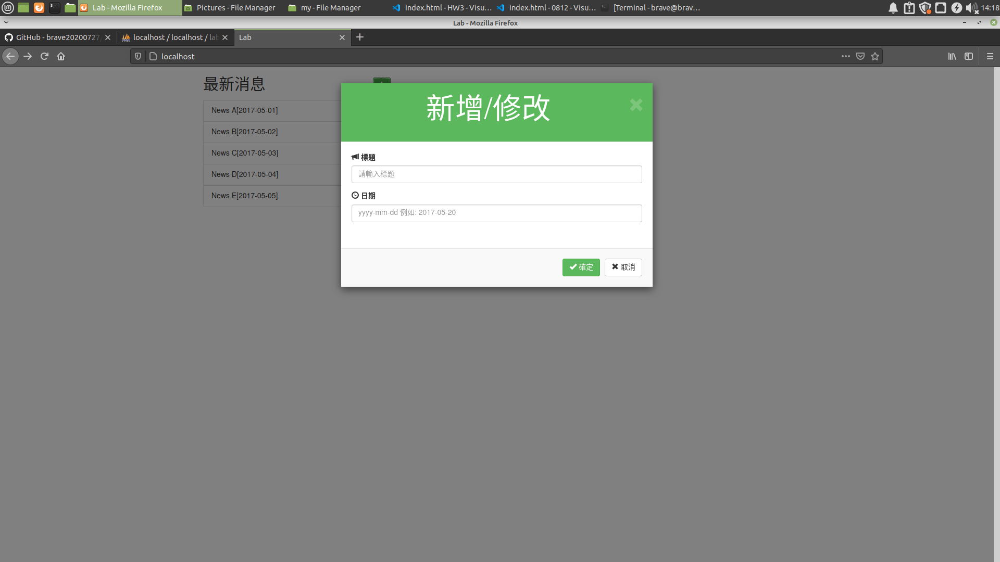
做出彈出式的modal並且設定為除了確定、取消及打叉之外不會有任何作動。

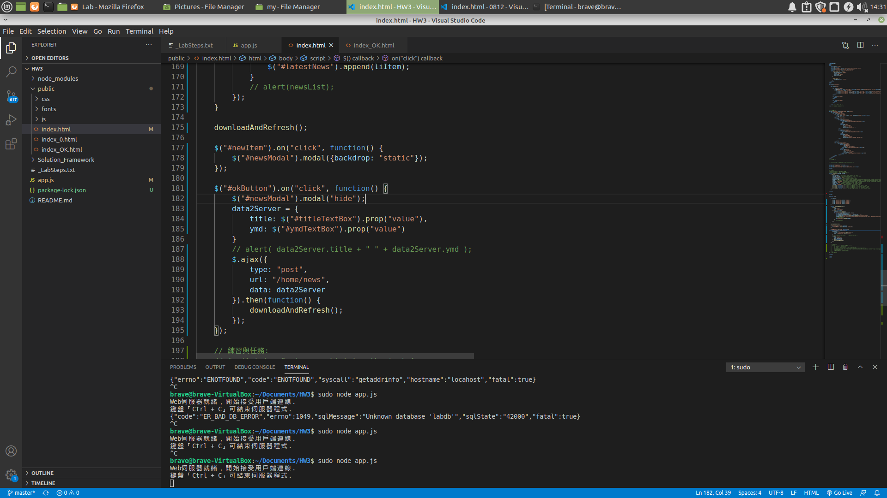
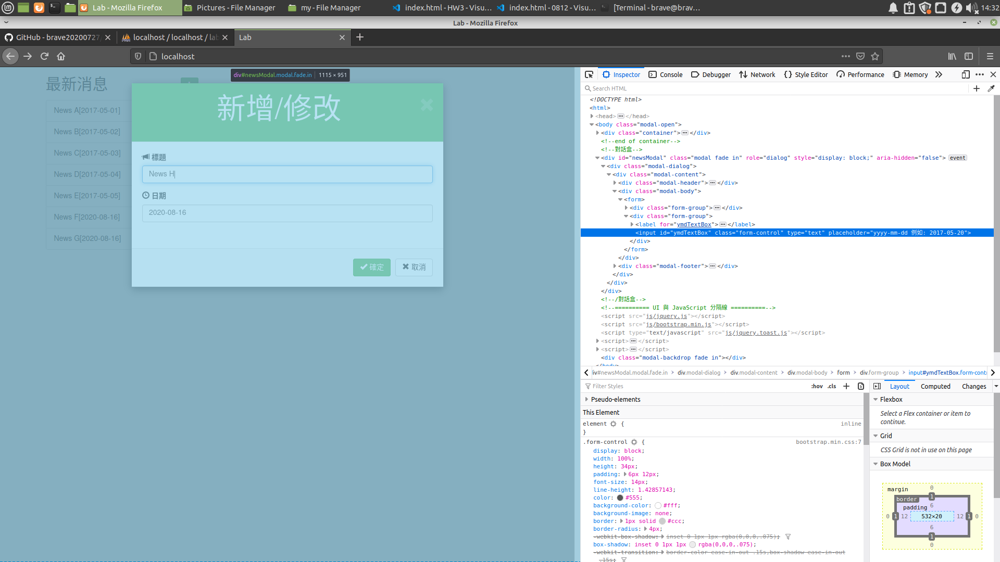
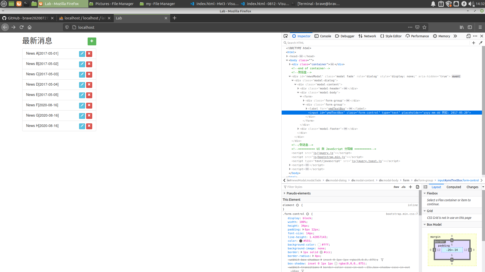
能夠將使用者輸入的東西加入資料庫中，並且顯示在網頁中。

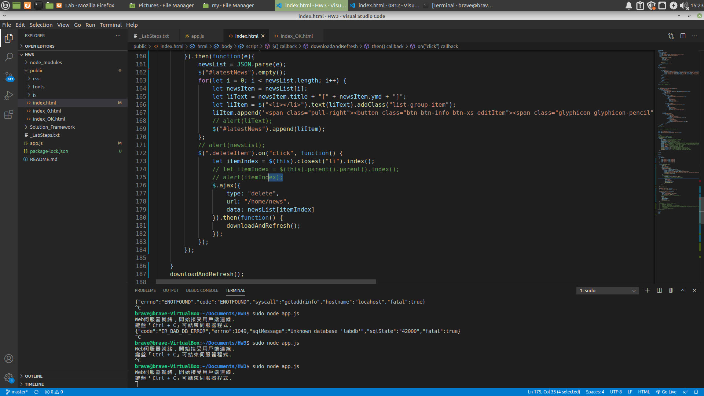
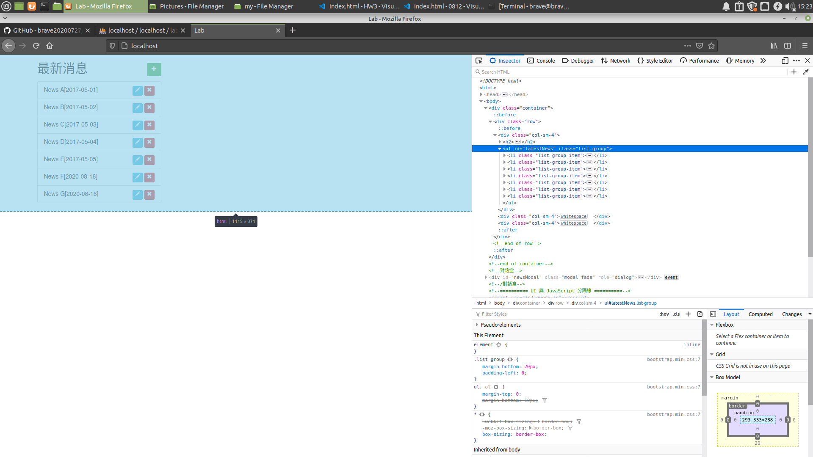
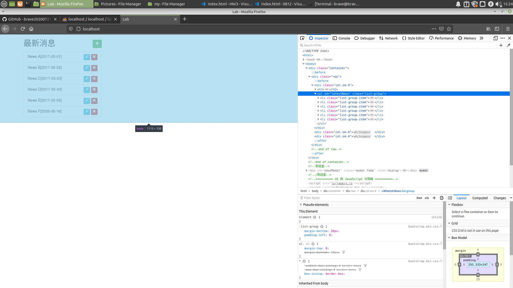
按下紅色的小叉叉能夠將資料刪除。

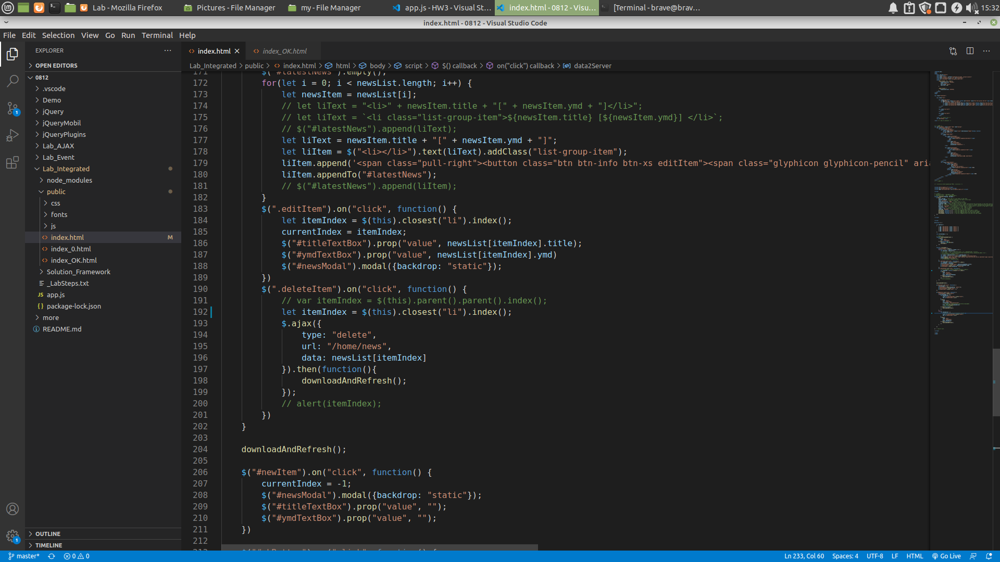
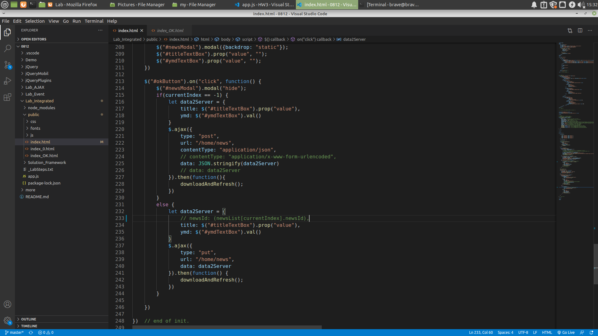

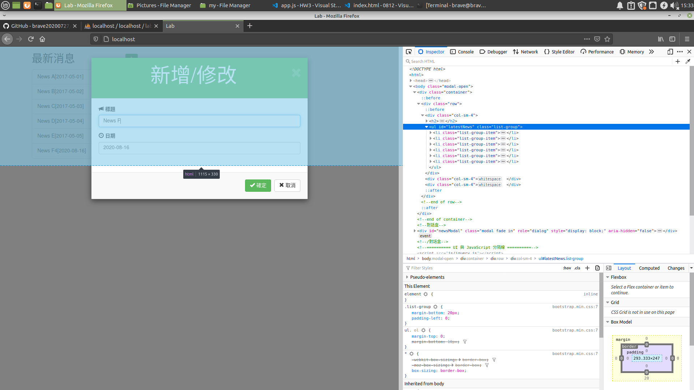
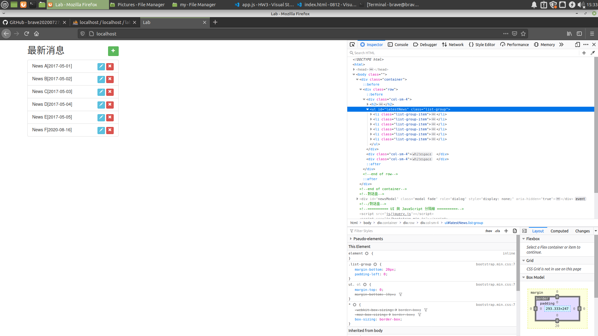
能夠將已經存在的資較進行資料的更新，並且修改成按下同樣的okButton能夠辨認是新增還是修改。

